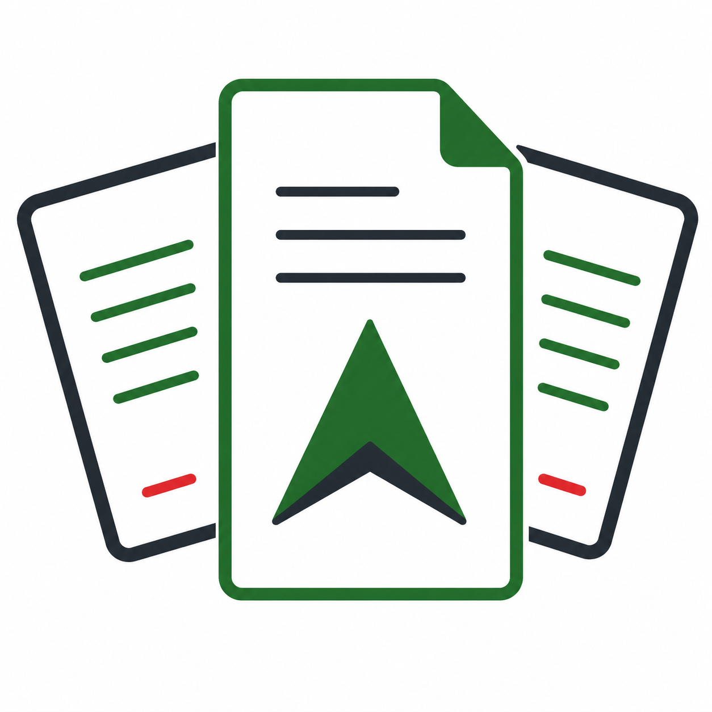

# Simplifica IF

<p align="center">
  
</p>

Ferramentas abertas para ajudar pessoas que trabalham com rotinas do IFPR a encontrar normas, conferir documentos e usar inteligência artificial com mais segurança.

A **Simplifica IF** organiza materiais públicos, scripts e orientações práticas para apoiar tarefas institucionais, acadêmicas e administrativas. A ideia é simples: juntar conhecimento que costuma ficar espalhado e transformar parte dele em bases consultáveis, checklists e ferramentas que economizam tempo.

> A Simplifica IF é uma iniciativa independente. Ela não é um canal oficial do Instituto Federal do Paraná (IFPR), não representa posicionamento institucional e não substitui sistemas, documentos, setores ou orientações oficiais.

Use os materiais daqui como apoio para estudar, organizar informações, preparar análises e revisar documentos. Para decisões administrativas, jurídicas, pedagógicas ou acadêmicas, confirme sempre nas fontes oficiais e com os setores competentes.

## Por onde começar

Se você não é uma pessoa técnica, pode pensar nesta organização como uma caixa de ferramentas:

- quer **consultar normas e leis** usadas em análises do IFPR? Comece pela [Base de Conhecimento](https://github.com/simplifica-if/base-conhecimento);
- quer **pedir para uma IA analisar um PPC em Word**? Veja a skill [Análise de PPC](https://github.com/simplifica-if/skills/tree/main/analise-ppc);
- quer **conferir um calendário acadêmico do IFPR** em planilha ou PDF? Veja a skill [Verificar Calendário](https://github.com/simplifica-if/skills/tree/main/verificar-calendario);
- quer **criar materiais com a identidade visual do IFPR**? Veja a skill [IFPR Design](https://github.com/simplifica-if/skills/tree/main/ifpr-design).

## Repositórios

### [base-conhecimento](https://github.com/simplifica-if/base-conhecimento)

Base de consulta com leis, resoluções, portarias, notas técnicas e outros documentos de referência. Os textos ficam em arquivos Markdown, que são fáceis de uma IA consultar.

Como usar com IA:

1. Abra o README da base.
2. Copie o prompt pronto da seção "Como usar".
3. Cole no ChatGPT, Claude, Codex, Cursor ou outra ferramenta capaz de acessar links.
4. Faça perguntas como: "Quais normas tratam de PPC de cursos técnicos?" ou "O que a base traz sobre adaptação curricular?"

### [skills](https://github.com/simplifica-if/skills)

Repositório com "skills", isto é, conjuntos de instruções, arquivos de apoio e scripts para uma IA executar tarefas específicas de forma mais organizada.

Em vez de pedir algo genérico como "analise este documento", a skill orienta a IA sobre quais passos seguir, quais critérios observar, quais arquivos consultar e que tipo de relatório entregar.

#### [analise-ppc](https://github.com/simplifica-if/skills/tree/main/analise-ppc)

Serve para apoiar a análise de Projetos Pedagógicos de Curso técnico do IFPR em arquivo Word (`.docx`).

O que ela faz:

- prepara o documento do PPC para análise;
- usa fichas de verificação organizadas por tema;
- consulta critérios ligados a matriz curricular, identificação do curso, ementário, CNCT e normas aplicáveis;
- executa validações cruzadas para procurar inconsistências;
- gera um relatório HTML final, que pode ser aberto no navegador.

Quando usar:

- para revisar um PPC antes de encaminhar;
- para levantar pendências e pontos de atenção;
- para organizar evidências antes de um parecer técnico-pedagógico;
- para tornar a análise mais padronizada e rastreável.

Formato aceito no momento:

- aceita PPC em Word (`.docx`);
- não aceita PPC em PDF para esse fluxo.

Exemplo de pedido para a IA:

```text
Use a skill analise-ppc para analisar o PPC em /caminho/para/PPC.docx
```

#### [verificar-calendario](https://github.com/simplifica-if/skills/tree/main/verificar-calendario)

Serve para conferir calendários acadêmicos do IFPR em planilha (`.xlsx`) ou PDF, com foco na Resolução CONSUP/IFPR nº 259/2025.

O que ela verifica:

- quantidade mínima de dias letivos;
- marcos obrigatórios previstos na norma;
- itens obrigatórios do calendário acadêmico;
- coerência entre calendário principal e documentos complementares;
- possíveis sinais de documento reaproveitado de outro ano ou com norma antiga.

O que entrega:

- relatório em Markdown (`.md`);
- relatório em PDF (`.pdf`);
- tabela com status e evidências para cada item verificado.

Exemplo de pedido para a IA:

```text
Use a skill verificar-calendario para verificar o calendário em /caminho/para/calendario.xlsx
```

Também é possível informar dois arquivos, como um calendário principal e uma tabela complementar de eventos.

#### [ifpr-design](https://github.com/simplifica-if/skills/tree/main/ifpr-design)

Serve para orientar a criação ou revisão de materiais visuais relacionados ao IFPR, como apresentações, documentos, páginas, relatórios e interfaces.

O que ela reúne:

- cores institucionais;
- orientações de tipografia;
- cuidados de contraste e acessibilidade;
- regras de uso do logo;
- arquivos de referência em CSS e JSON;
- imagem do logo do IFPR para uso em materiais.

Quando usar:

- ao montar apresentações;
- ao gerar relatórios;
- ao criar páginas ou protótipos;
- ao revisar materiais para manter aparência consistente com a identidade visual institucional.

